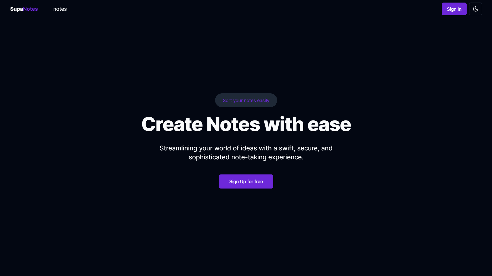
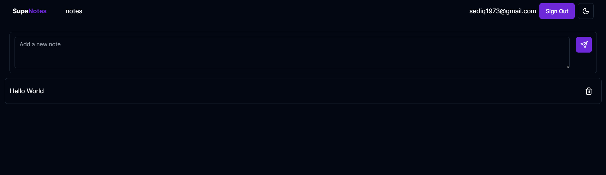

# Quick Notes

## Introduction
Welcome to SimpleNotes, an innovative and secure note-taking application that combines the latest web technologies to deliver a seamless and intuitive user experience. At its core, SimpleNotes leverages the power of Next.js, TypeScript, Supabase, and Tailwind CSS to create a robust platform that is both fast and flexible.

## Features
- Utilized Next.js API routes in conjunction with Supabase's server actions to handle logic on the server side, ensuring efficient and secure data processing.
- Employed TypeScript to define data models and types for both Next.js components and Supabase interactions, ensuring a cohesive and error-free development process.
- Utilized Supabase row-level security policies, ensuring that users can only access their own notes, providing an extra layer of data protection and privacy.

## Technologies
- Next.js: A React framework that provides server-side rendering, static site generation, and serverless functions.
- TypeScript: A statically typed superset of JavaScript that enhances code quality and developer productivity.
- Supabase: An open-source alternative to Firebase that provides a real-time database, authentication, and storage services.
- Tailwind CSS: A utility-first CSS framework that enables rapid UI development and customization.

## Visuals





## Installation

1. Clone the repository:
```bash
git clone https://github.com/shoibDev/Quick-Notes.git
cd Quick-Notes
npm install
```
2. Create a Supabase account and project, and obtain your API URL and key.

3. Edit the `.env.local` file with your Supabase API URL and key:
```bash
NEXT_PUBLIC_SUPABASE_URL=your_api_url
NEXT_PUBLIC_SUPABASE_ANON_KEY=your_api_key
```

5. Setup the database schema and policies by running the following SQL commands to create the necessary tables
```SQL
CREATE TABLE notes (
  id BIGINT GENERATED BY DEFAULT AS IDENTITY PRIMARY KEY,
  user_id UUID REFERENCES auth.users NOT NULL,
  title TEXT CHECK (char_length(title) > 3),
  description TEXT NOT NULL,
  created_at TIMESTAMP WITH TIME ZONE DEFAULT (now() AT TIME ZONE 'UTC') NOT NULL,
  priority TEXT CHECK (priority IN ('High', 'Medium', 'Low')) NOT NULL
);

-- Enable row-level security
ALTER TABLE notes ENABLE ROW LEVEL SECURITY;

-- Create a policy for selecting own notes
CREATE POLICY select_own_notes ON notes
USING (user_id = auth.uid());

-- Create a policy for inserting own notes
CREATE POLICY insert_own_notes ON notes
FOR INSERT
WITH CHECK (user_id = auth.uid());

-- Create a policy for updating own notes
CREATE POLICY update_own_notes ON notes
FOR UPDATE
USING (user_id = auth.uid());

-- Create a policy for deleting own's notes
CREATE POLICY delete_own_notes ON notes
FOR DELETE
USING (user_id = auth.uid());
```

6. Start the development server:
```bash
npm run dev
```